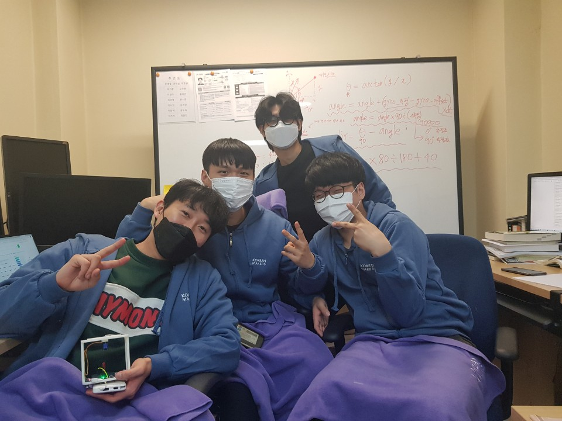

# [GCamp Hardware Hackaton]  SHH2021_Not-alone
## 프로젝트 소개

주제 : 언택트 시대에 사회적 약자의 문제를 해결하는 ICT 기술

## 프로젝트 개요

**언택트시대**로 인해 매장 내 키오스크의 도입이 많아지고 있습니다. 하지만 정작 사회적약자인 시각장애인들은 직원없이 키오스크가 어디에 있는지 조차 찾기가 어려운 실정입니다. 시각장애인들이 키오스크 위치를 쉽게 찾는 것을 도와줍니다.

---

### **대상 고객**

시각장애인

### **해결 문제점**

 시각장애인들이 매장에 들어가서 키오스크의 위치를 찾는데에 겪는 어려움을 해결해줍니다.

### **하드웨어의 장점**

보통 시각장애인들이 가지고 다니는 지팡이와 결합하면 또 다른 짐이 생기지 않습니다.

--- 

# 프로젝트 차별점

시각장애인들이 음성으로 위치를 파악하는 것이 아니라 실제로  손으로 감각을 느끼며 찾기 때문에 훨씬 정확합니다. 

실시간으로 `localization` 과 `mapping` 하는 `slam` 기술과 결합이 된다면 현재 목표를 둔 키오스크와의 거리도 알려줄수 있고 매장 이외의 영화관이나 도심에서의 키오스크의 위치도 알려줄 수 있는 발전가능성이 있습니다.

# 각 단계별 시스템 구성도 및 팀원 역할

### **각 단계별 동작**

- 사용보드 : `STM32` 보드 `B-L4S5I-IOT01A`
- 사용 SW : `STM32cubeIDE`
- 프로그램 툴을 이용해 stl 설계 후 3d프린팅 출력
  
1. 시각 장애인이 매장에 들어가면 클라우드에서 키오스크 위치정보를 보드에 보냅니다.

2. 위치정보에 따라 서보모터가 반응하여 키오스크 위치를 가리킵니다.

3. `LSM6DSL` 센서를 통해 보드를 돌려도 키오스크 위치를 따라가게 합니다.

---
### **팀원 역할**

오동훈 : 팀장, 통신, s/w 개발

전민우 : 임베디드 s/w 개발, 영상제작

안사훈 : 임베디드 s/w 개발, 기획, 발표

윤요한 : h/w 개발, 디자인, 카티아

